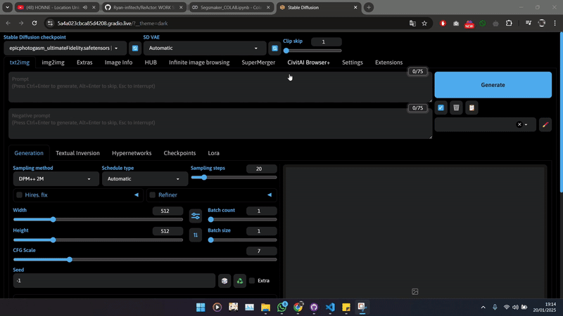

  
    
  
  
  

# ReActor
ReActor Plugin for Stable Diffusion [19/01/2025] - Work

## Automatic1111/Stable-Diffusion-WebUI

### Features:
- Fast and accurate face replacement.
- Support for multiple faces in a single image.
- Gender detection.
- Save and load face models in 'safetensors' format.
- Face restoration to improve quality.
- Image upscaling to enhance resolution and quality.
- Face mask correction to avoid pixelation around contours.
- Fast performance with CUDA acceleration and CPU compatibility.

# Table of Contents

- [Table of Contents](#table-of-contents)
  - [Usage Rules](#usage-rules)
  - [Installation](#installation)
  - [Acknowledgments](#acknowledgments)
  - [Contact](#contact)

## Usage Rules

1. Please ensure you have the rights to use source images or videos.
2. Clearly credit original sources.
3. All copyright and legal issues are the user's responsibility.
4. Use this plugin in accordance with applicable laws.

## Installation

1. Open the **Extensions** tab in WebUI.
2. Click **Install from URL**.
3. Enter the following repository URL:
   `https://github.com/Ryan-infitech/ReActor`
4. Click **Install**.
5. Restart WebUI after installation is complete.

 

## Acknowledgments

- [Gourieff](https://github.com/Gourieff)
- [gutris1](https://github.com/gutris1)

 

## Contact

If you have any questions or suggestions, please open a new issue in this repository.

